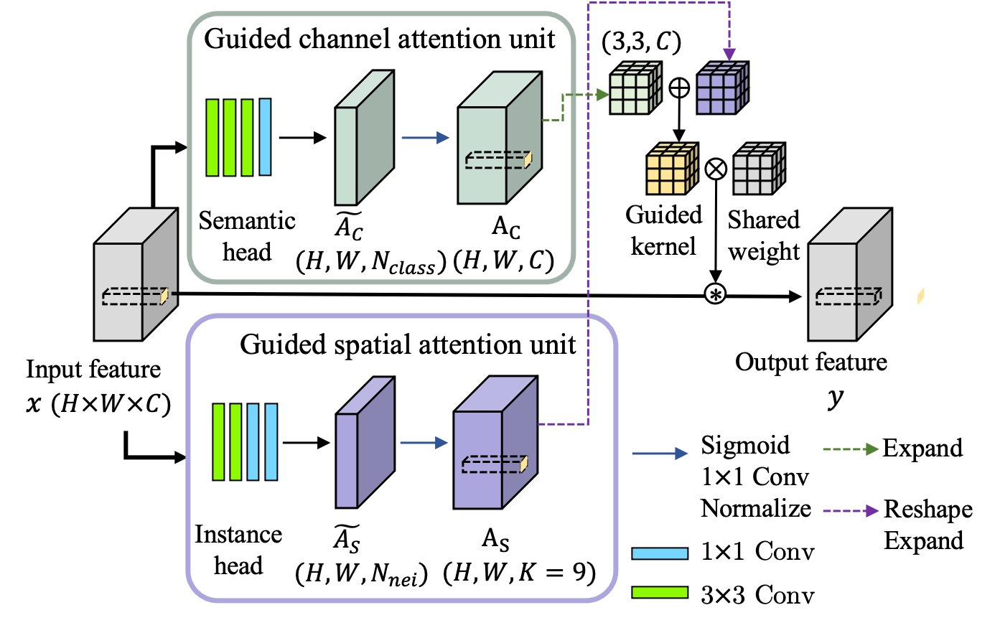

# GuidedPAKA
**Semantic and Instance-Aware Pixel-Adaptive Convolution for Panoptic Segmentation**

[[`arxiv`](), [`Bibtex`]()]

<div align="center">
    
</div></br>

This project provides an implementation of paper "Semantic and Instance-Aware Pixel Adaptive Convolution for Panoptic Segmentation" based on [Detectron](https://github.com/facebookresearch/detectron2). GuidedPAKA is the first content-adaptive convolution method specialized for panoptic segmentation. We insert GuidedPAKA to the FPN structure toward broad applicability, and use [PanopticFCN](https://github.com/dvlab-research/PanopticFCN) as base network for panoptic segmentation.


## Installation
This project is based on [Detectron2](https://github.com/facebookresearch/detectron2), which can be constructed as follows.
* Install Detectron2 following [the instructions](https://detectron2.readthedocs.io/tutorials/install.html).
* Setup the dataset following [the structure](https://github.com/facebookresearch/detectron2/blob/master/datasets/README.md).
* Copy this project to `path/to/detectron2/projects/GuidedPAKA`

## Training
To train a model with 4 GPUs, run:
```bash
cd /path/to/detectron2
python3 projects/GuidedPAKA/train.py --config-file <config.yaml> --num-gpus 4
```

For example, to train GuidedPAKA with 1x scheduler with 4 GPUs,
```bash
cd /path/to/detectron2
python3 projects/GuidedPAKA/train.py --config-file projects/GuidedPAKA/configs/PanopticFCN-R50-1x.yaml --num-gpus 4 
```

## Evaluation
To evaluate a pre-trained model with 4 GPUs, run:
```bash
cd /path/to/detectron2
python3 projects/GuidedPAKA/train.py --config-file <config.yaml> --num-gpus 4 --eval-only MODEL.WEIGHTS /path/to/model_checkpoint 
```

## Results
We provide the results on COCO *val* set with pretrained models. 

<table><tbody>
<!-- START TABLE -->
<!-- TABLE HEADER -->
<th valign="bottom">Method</th>
<th valign="bottom">Base Network</th>
<th valign="bottom">Sched</th>
<th valign="bottom">PQ</th>
<th valign="bottom">SQ</th>
<th valign="bottom">RQ</th>
<th valign="bottom">AP</th>
<th valign="bottom">mIoU</th>
<th valign="bottom">config</th>
<th align="bottom">download</th>
<!-- TABLE BODY -->
<tr>
<td align="left">GuidedPAKA</td>
<td align="center">PanopticFCN</td>
<td align="center">1x</td>
<td align="center">42.0</td>
<td align="center">80.2</td>
<td align="center">50.7</td>
<td align="center">33.3</td>
<td align="center">42.8</td>
<td align="center"><a href="https://1drv.ms/u/s!AnaMW2Xn7PpMiTNfPZ75x6H9vTz3?e=SEowEM">config</a>
<td align="center"><a href="https://1drv.ms/u/s!AnaMW2Xn7PpMiS3q3a10Lv4Dm-Ps?e=96k1SB">model</a>
</tr>
<tr>
<td align="left">GuidedPAKA</td>
<td align="center">PanopticFCN</td>
<td align="center">3x_star</td>
<td align="center">45.3</td>
<td align="center">82.3</td>
<td align="center">54.1</td>
<td align="center">36.8</td>
<td align="center">44.7</td>
<td align="center"><a href="https://1drv.ms/u/s!AnaMW2Xn7PpMiTL9_wqZ29maRaMt?e=hJnfAi">config</a></td>
<td align="center"><a href="https://1drv.ms/u/s!AnaMW2Xn7PpMiS4kHeqRV0ZkXwsh?e=akmfTd">model</a>
</tr>
</tbody></table>

